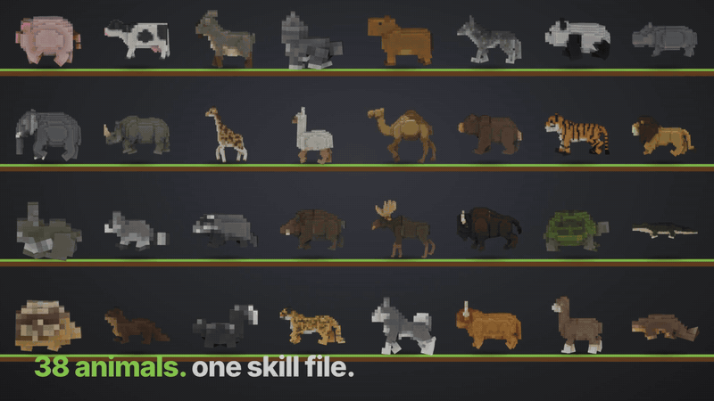
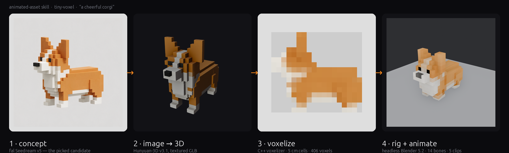
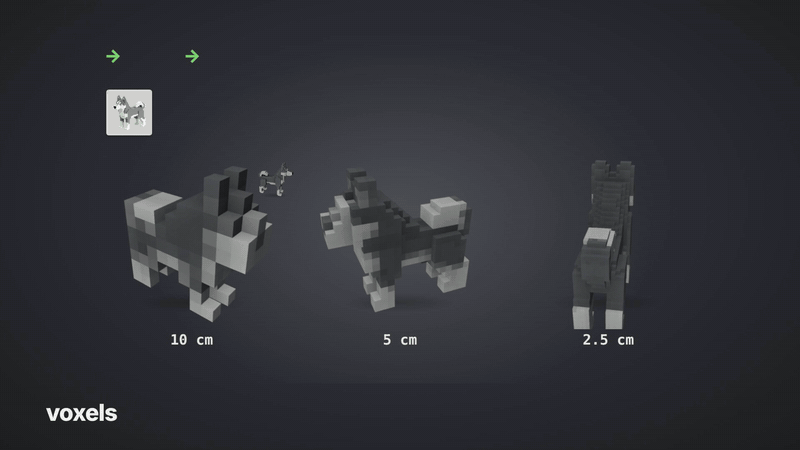
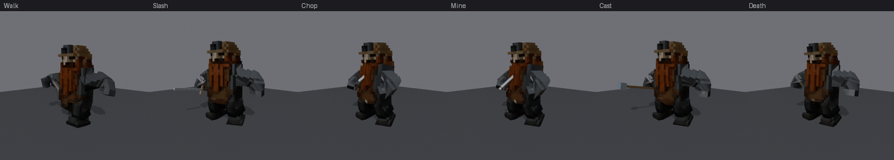
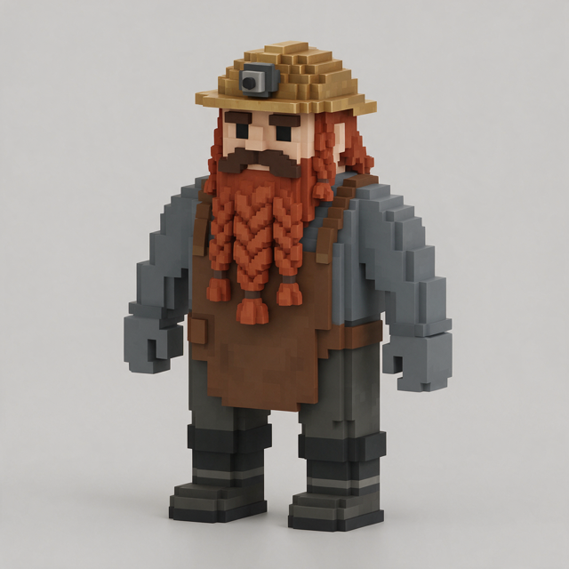

# animated-asset

**One sentence in. A rigged, animated voxel character out.**

Two [Claude Code](https://claude.com/claude-code) skills and the tools behind them, built for my voxel game:

- **`animated-asset`** — "a cheerful corgi" → a quadruped with 13 procedural gait clips. Ran it on 40 animals in one go.
- **`rpg-character`** — "a dwarf miner" → a humanoid with 33 RPG clips (sword, two-hand chop, mining, spellcasting, block, hit, death, interact, pick-up, jump, sit …) retargeted from a CC0 library, plus weapon slots and voxel props.

Both derive the skeleton from the voxel grid, verify the result with maths rather than by eye, and export glTF.



## How it works

| Stage | What happens | Tool |
|---|---|---|
| 1. concept | fal Seedream draws 4 voxel-style concepts from a prompt template. **You pick one.** | `tools/pipeline/concept.py` or the fal MCP tools |
| 2. mesh | Hunyuan-3D turns the picked image into a textured mesh | fal, via `run_creature.py` |
| 3. voxelize | A small C++ voxelizer cuts the mesh into 5 cm cells, detects which end is the head | `tools/voxelizer` |
| 4. rig + animate | Headless Blender reads the body plan off the voxel grid, builds a 14-bone rig, authors 13 clips, checks the gaits with math, exports glTF | `tools/rig` |



The trick that makes it work on any quadruped: the skeleton is **derived from the voxels**. The leg zone is the bottom layers that are still split into separate blobs, the tail is the narrow trailing slices, the head is whatever rises above the back at the front. The same gait maths then runs on every animal, scaled by leg length.



Gaits are verified numerically, never by eye: every planted foot has to sweep tailward and touch the ground, the gallop needs a frame with zero feet down, one-shot clips have to return to the rest pose. A vision-model panel once approved a backwards walk on this project; nothing visual is a gate anymore.

## rpg-character: humanoids with an RPG move set





Same front end (concept → Hunyuan-3D → voxels), different back end. The dwarf in the GIF started as the concept on the right: four Seedream candidates, one picked, Hunyuan-3D mesh, 22×12×30 voxels, and the body plan below read off the grid with no per-character tuning. `tools/biped/bipedrig.py` reads a humanoid body plan off the grid — feet, legs plus a chibi pelvis, hips/spine/chest, hanging or T-pose arms with the merged shoulder layers, head, mitten hands — and `biped_build.py` builds a 17-bone rig, then **retargets** clips from the CC0 [KayKit Adventurers](https://github.com/KayKit-Game-Assets/KayKit-Character-Pack-Adventures-1.0) rig (vendored, 76 clips) onto it: every mapped bone is re-rolled into the source's frame convention once, then its world rotation is copied per frame. The direction check reports 0.000° on every clip; feet are clamped to the floor; each attack gets a **hit frame** from the weapon-slot speed peak.

```bash
python tools/pipeline/concept.py Dwarf --kind humanoid --idea "a stout dwarf miner with a braided beard" --height-m 1.5
python tools/pipeline/run_character.py Dwarf --image-url <picked url> --height-m 1.5 --render
```

Output: `Dwarf_animated.glb` with 33 named animations, `handslotL/R` bones, and `Prop_sword/axe/pickaxe/staff` voxel meshes parented to the right slot; `clips.json` says which prop and hit frame belong to each clip. Already have a character? `--glb model.glb` or `--vox model.vox`. Mixamo FBX files work as a source through `--source file.fbx --map tools/biped/maps/mixamo.json` (they may not be redistributed, so none are included); the Quaternius library maps through `maps/ual.json`.

Clips: Idle · Walk · Run · JumpStart · JumpLoop · JumpLand · SwordIdle · Slash · SlashDiag · Stab · Overhead · Chop · Mine · Slice2H · Spin · Block · BlockHit · CastRaise · Cast · CastLong · Casting · Punch · Kick · Interact · PickUp · UseItem · Throw · Hit · Death · Cheer · DodgeBack · SitDown · SitIdle. Add one with a line in `tools/biped/presets/rpg_kaykit.json`.

## animated-asset: quadruped clips

Idle · Walk · Gallop · Graze · Alert · Trot · Jump · Sit · Sleep · Shake · Stretch · LookAround · Rear — same names on every animal, so a state machine can key on them. Each clip is a small Python module in `tools/rig/clips/`; adding one means writing a module that defines `EXTRA_ACTION`, `EXTRA_LENGTH` and an `EXTRA_GUARD` string.

## Quick start

Requirements: [Blender 5.2 LTS](https://www.blender.org/download/lts/) on your PATH (or `export BLENDER=/path/to/blender`), CMake + a C++17 compiler, Python 3.10+, and a [fal](https://fal.ai) API key.

```bash
git clone https://github.com/rehan-remade/animated-asset-skill
cd animated-asset-skill
pip install -r requirements.txt

# build the voxelizer once
cmake -S tools/voxelizer -B tools/voxelizer/build -DCMAKE_BUILD_TYPE=Release
cmake --build tools/voxelizer/build --config Release

export FAL_KEY=...            # or put the key in ~/.fal/key

# 1. concepts (4 images, ~$0.27) -> pick one from assets/Corgi/concept/concept_sheet.png
python tools/pipeline/concept.py Corgi --idea "a cheerful corgi" --len-m 0.9 \
  --anatomy "a long loaf body, two tall triangular ears as stepped cubes, four very short thick legs clearly separated, a stub tail" \
  --colors "orange back, white chest, muzzle and paws, black nose"

# 2-4. mesh (~$0.68, ~2.5 min) -> voxels -> rig + 13 clips (~10 s) -> glTF
python tools/pipeline/run_creature.py Corgi --image-url <picked url> --len-m 0.9
```

Output lands in `assets/Corgi/`: the mesh, the `.vox`, side/front/top previews, the derived `layout.json` and `corgi_rules.py`, `Corgi_rigged.blend`, `Corgi_animated.glb` with every clip, and a `report.json` with the guard results. Add `--video` for a preview MP4 per clip.

Already have a mesh or a `.vox`? Skip ahead with `--glb model.glb` or `--vox model.vox`.

### Using them as Claude Code skills

Copy `skill/animated-asset/` and/or `skill/rpg-character/` into your project's `.claude/skills/` (or `~/.claude/skills/` for every project), keep the `tools/` folder somewhere Claude can run it, and connect the [fal MCP server](https://mcp.fal.ai/mcp) if you want stage 1 to happen inside the conversation. Then:

> add a corgi
> make a dwarf miner who can swing a pickaxe

Claude runs the stages, stops to let you pick a concept, and reports the guards. `references/rigging-traps.md` is the part worth reading even if you never run the skill: it is every way this pipeline produced wrong animation that looked right.

## What to expect

- **Quadrupeds and standing humanoids.** Two body plans with derived proportions. Birds, snakes, centaurs, moving tails and wings need their own build script.
- **Humanoid clips are retargeted, not authored.** They inherit KayKit's timing and style; capes, skirts, tails and held objects in the concept confuse the body plan, so keep them out and add items as props.
- **Blocky animals are the easy case.** Voxel meshes are clean by construction and rigid weights are correct for them. Nothing here claims organic characters.
- **Facing can flip** on animals whose rump is higher than the head (rhino, boar) or whose tail is raised (skunk). Check the side preview; fix with `--yaw`.
- **Very short legs can't gallop.** A hedgehog with one-voxel legs passes the walk guard and fails the airborne check. The clip still exports; it reads as a fast trot.
- On the 40-animal batch this repo came from, 39 passed every guard on the first run. Cost was about $38 of fal credit for 160 concept images and 40 meshes, and 3 to 5 seconds of Blender per animal.

## Layout

```
skill/animated-asset/       SKILL.md + references (fal-generation.md, rigging-traps.md)
skill/rpg-character/        SKILL.md + references/retargeting.md
tools/voxelizer/            mesh -> .vox (C++17, vendored tinyobjloader / cgltf / stb)
tools/rig/                  generic_quad_build.py (rig + base clips + glTF export), voxrig.py (body plan + bone rules), clips/*.py
tools/biped/                bipedrig.py (humanoid body plan), biped_build.py (rig + retarget + export), retarget_lib.py, maps/ (kaykit, mixamo, ual), presets/rpg_kaykit.json, anims/kaykit/Knight.glb (CC0)
tools/pipeline/             concept.py, run_creature.py, run_character.py, clip_sheet.py, fal_client.py, contact_sheet.py
examples/creatures.json     the prompt anatomy/colour lines used for the 40-animal batch
```

## Credits and licence

MIT. The humanoid animation source `tools/biped/anims/kaykit/Knight.glb` is Kay Lousberg's KayKit Adventurers pack, CC0 (its licence file sits next to it). Vendored headers ([tinyobjloader](https://github.com/tinyobjloader/tinyobjloader), [cgltf](https://github.com/jkuhlmann/cgltf), [stb](https://github.com/nothings/stb)) keep their own MIT / public-domain licences. Seedream and Hunyuan-3D are third-party models served by fal under their own terms.

Built with Claude Code for [tiny-voxel](https://x.com/rehan_shei). I work at fal; this is a side project.
